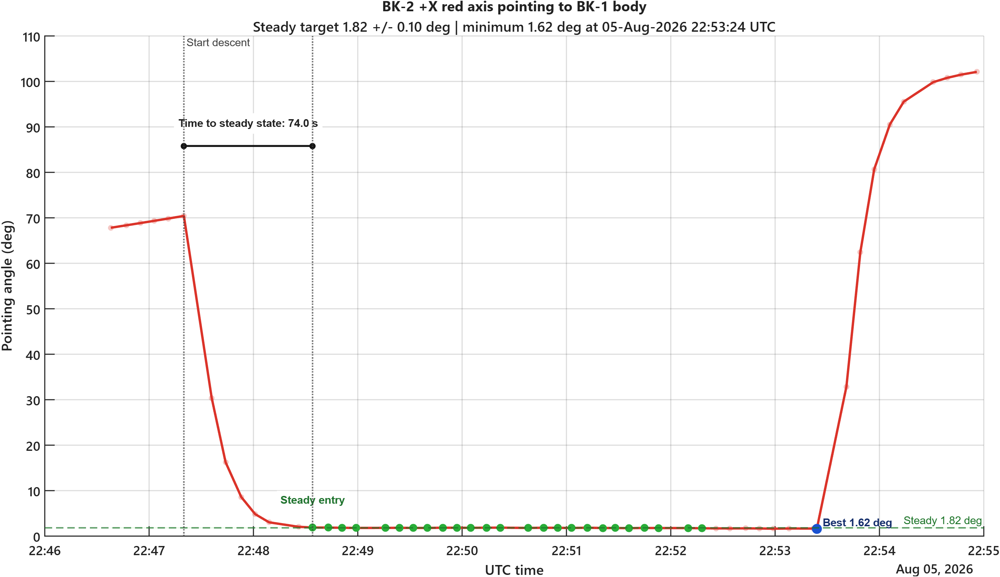

# Simulation and Performance Analysis of LEO Satellite ADCS

**Primary spacecraft:** BK-2  
**Target spacecraft:** BK-1  
**Pointing objective:** BK-2 body-frame +X axis alignment toward BK-1  
**Generated:** 2026-08-13 02:05:03 UTC

## Abstract

This report presents an automated simulation and performance assessment workflow for
a Low Earth Orbit (LEO) satellite Attitude Determination and Control System (ADCS).
The analysis validates whether the BK-2 spacecraft can maintain its body-frame +X
axis pointing direction toward the BK-1 target spacecraft. Using MATLAB-generated
orbital and attitude telemetry outputs, the workflow extracts mission-level
performance indicators and produces a portfolio-ready technical summary suitable
for academic review and engineering documentation.

## I. Methodology

The simulation workflow combines Two-Line Element (TLE) orbital mechanics with ADCS
attitude telemetry to reconstruct the relative geometry between BK-2 and BK-1. TLE
data define the propagated inertial positions of both spacecraft, while quaternion
telemetry is used to transform the BK-2 body-frame pointing axis into the orbital
and inertial reference frames. Target satellite Euler-angle telemetry is also
validated to ensure consistency with the expected ADCS data format.

The mission criterion is based on a commanded pointing target of
**1.82 deg** with an allowable tolerance of
**+/- 0.10 deg**. The pointing error is computed as
the angular separation between the BK-2 +X body axis and the BK-2-to-BK-1 line of
sight vector. Samples within the specified tolerance band are classified as
near-steady pointing conditions.

## II. Automated Workflow

The Python automation script performs four sequential operations:

1. Optionally executes the MATLAB simulation in batch/headless mode.
2. Reads MATLAB-generated CSV outputs using `pandas` and the standard `csv` module.
3. Extracts mission KPIs, including success rate, mean pointing error, and maximum
   tolerance deviation.
4. Generates this Markdown report for publication in a GitHub repository or
   GitHub Pages portfolio.

## III. Results

| Metric | Value |
| --- | ---: |
| Overall near-steady success rate | 46.30% |
| Mean pointing error | 22.4047 deg |
| Maximum tolerance deviation | 100.2796 deg |
| Best pointing angle | 1.6207 deg |
| Best pointing time | 05-Aug-2026 22:53:24 |
| First steady-entry time | 05-Aug-2026 22:48:34 |

The following figure summarizes the pointing-angle response and highlights the
steady-state tolerance region used for mission-level evaluation.

The accompanying 3D visualization is available as `BK2_to_BK1_3D_pointing_animation.mp4`.

## IV. Engineering Interpretation

The extracted KPIs indicate how effectively the BK-2 attitude solution aligns the
spacecraft body-frame +X axis with the BK-1 target direction. The near-steady
success rate quantifies the proportion of valid telemetry samples satisfying the
mission tolerance band, while the mean pointing error and maximum tolerance
deviation provide complementary views of nominal and worst-case attitude
performance.

This automated pipeline is designed to support repeatable ADCS analysis: updated
TLE sets, telemetry files, or pointing-axis definitions can be evaluated without
manually rewriting the report. This makes the workflow useful for design
iteration, verification evidence, and portfolio presentation.

## V. Conclusion

This project demonstrates an end-to-end aerospace systems workflow linking orbital
mechanics, spacecraft attitude representation, automated KPI extraction, and
technical reporting. By validating BK-2's +X body-axis pointing behavior toward
BK-1 under a strict 1.82 deg +/- 0.10 deg criterion, the analysis shows practical
competence in ADCS simulation, data-driven verification, and engineering
communication. The resulting automation framework is suitable for extension into
larger mission analysis pipelines and reflects the technical preparation expected
for advanced international Master's-level study in Electrical and Aerospace
Engineering.
